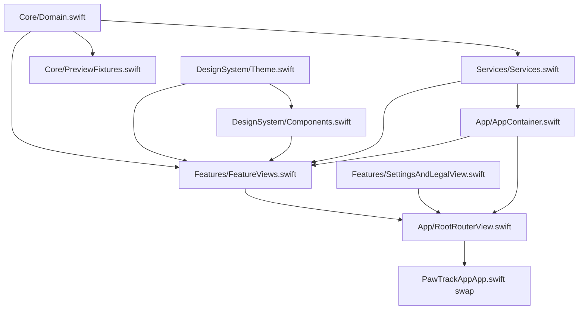

## Dependency layering (full migration order)

The existing code at [App/PawTrack](App/PawTrack) splits cleanly into layers. Move bottom-up so the project compiles after every step.



Recommended ordered steps (we will do them one at a time, you verify each in Xcode before moving on):

1. `Core/Domain.swift` ← start here
2. `DesignSystem/Theme.swift`
3. `DesignSystem/Components.swift`
4. `Core/PreviewFixtures.swift`
5. `Services/Services.swift`
6. `App/AppContainer.swift`
7. `Features/FeatureViews.swift`
8. `Features/SettingsAndLegalView.swift`
9. `App/RootRouterView.swift`
10. Swap `PawTrackAppApp.swift` to use `RootRouterView` + the new schema, retire `Item.swift` / `ContentView.swift`.

## Step 1 (this step): move `Domain.swift`

`Domain.swift` is the foundation: it defines every `@Model` SwiftData class (`PetProfile`, `ActivityLog`, `FoodWaterLog`, `MedicationLog`, `WeightEntry`, `ReminderItem`), the supporting enums, and `DomainValidator`. It imports only `Foundation` and `SwiftData` — zero dependencies on any other PawTrack file — so it's the safest first move.

Source: [App/PawTrack/Core/Domain.swift](App/PawTrack/Core/Domain.swift)

```1:9:App/PawTrack/Core/Domain.swift
import Foundation
import SwiftData

enum LogCategory: String, Codable, CaseIterable, Identifiable {
    case activity
    case foodWater
    case medication
    var id: String { rawValue }
}
```

### What I'll do when you give the go-ahead

- Create folder `PawTrackApp/PawTrackApp/Core/` and copy the file to `PawTrackApp/PawTrackApp/Core/Domain.swift` (byte-for-byte identical).

### What you do in Xcode (manual verification)

1. In the Project navigator, right-click the `PawTrackApp` group → "Add Files to PawTrackApp…" → select the new `Core/Domain.swift` (or drag the `Core` folder in; choose "Create groups", target = `PawTrackApp`, "Copy items if needed" off since the file already lives inside the project folder).
2. Confirm `Domain.swift` shows membership in the `PawTrackApp` target (File Inspector → Target Membership).
3. Do **not** touch `Item.swift`, `ContentView.swift`, or `PawTrackAppApp.swift` yet. The existing `Schema([Item.self])` keeps the app launching exactly as it does today; the new `@Model` types are present but unregistered, which is fine.
4. Build (Cmd-B). Expected: clean build, no errors. Run on simulator — app should launch the same default `ContentView` you had before.

### Why not change the schema in step 1

Mixing the schema swap with adding new model files makes failures ambiguous. We isolate "can the project compile these new models?" from "does SwiftData accept the new schema?" The schema swap is its own dedicated step at the end (step 10) so any migration/launch failure is unmistakably tied to that change.

### Acceptance for step 1

- Build succeeds.
- App launches and behaves identically to the fresh template (still shows the default `ContentView` with `Item` rows).
- `Domain.swift` is visible in the target and in the Project navigator under a `Core` group.

Once you confirm those three, reply and we move to step 2 (`Theme.swift`).