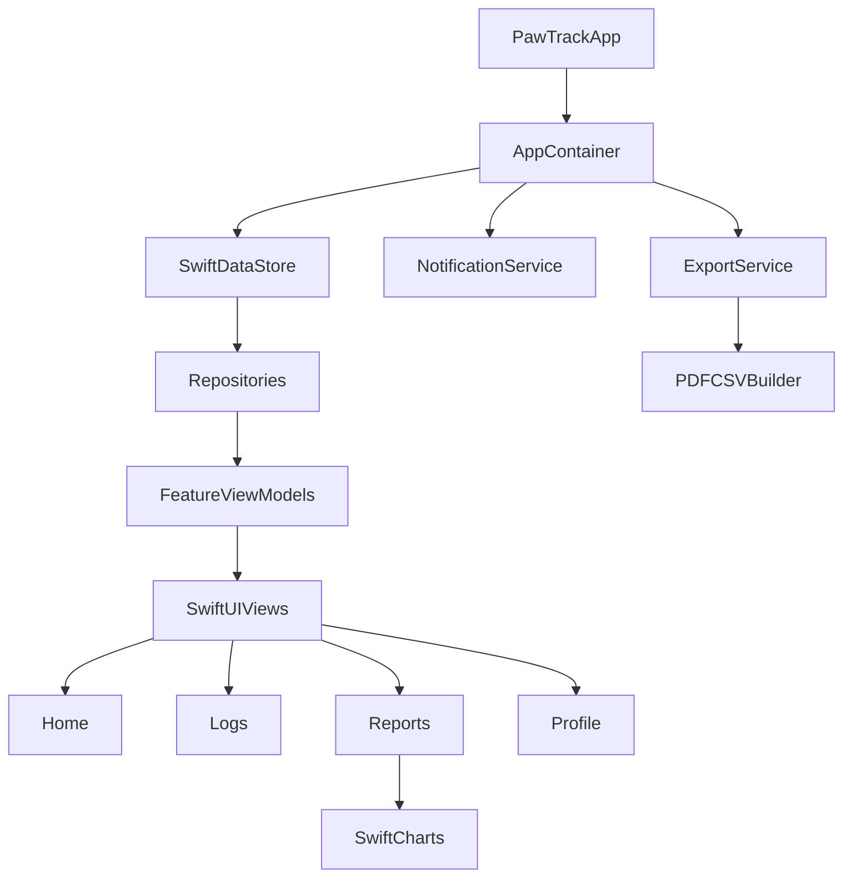

# PawTrack SwiftUI Implementation Plan

## Source Context Reviewed
- Product goals/features from [`C:/Users/62707/OneDrive/文档/Repos/PawTrack/README.md`](C:/Users/62707/OneDrive/文档/Repos/PawTrack/README.md)
- Visual/UX system from [`C:/Users/62707/OneDrive/文档/Repos/PawTrack/design/pawtrack/DESIGN.md`](C:/Users/62707/OneDrive/文档/Repos/PawTrack/design/pawtrack/DESIGN.md)

## Assumptions (Default Choices)
- iOS target: iOS 17+
- UI: SwiftUI-first, with NavigationStack + TabView
- Persistence: SwiftData (single local store)
- Notifications: UNUserNotificationCenter local notifications
- Export: PDF + CSV generated locally and shared via Share Sheet
- Single-user local app (no cloud sync in v1)

## Step-by-Step Build Roadmap

### Phase 0 - Project Foundation (Week 1)
1. Create Xcode project with modules/folders:
   - `App`, `Core`, `Features`, `DesignSystem`, `Services`, `Resources`, `Tests`
2. Set up app entry + dependency container (`AppContainer`) to inject store, notification manager, export service.
3. Add SwiftData schema scaffold and configure `ModelContainer` in app startup.
4. Add design tokens from your design doc (colors, spacing, typography wrappers) into `DesignSystem`.
5. Add reusable base UI components:
   - `PrimaryButton`, `SecondaryButton`, `CardView`, `TagChip`, `AppTextField`, `SectionHeader`
6. Create app-wide navigation shell:
   - Tabs: `Home`, `Logs`, `Reports`, `Profile`
7. Add baseline test targets and a smoke UI test that launches app and opens each tab.

### Phase 1 - Data Model + Domain Rules (Week 1-2)
1. Define SwiftData models:
   - `PetProfile`
   - `ActivityLog`
   - `FoodWaterLog`
   - `MedicationLog`
   - `WeightEntry`
   - `ReminderItem`
2. Add supporting enums/value types:
   - `LogCategory`, `StoolCondition`, `BehaviorTag`, `MealType`, `DoseUnit`, `ReminderType`
3. Define lightweight repository protocols and implementations per aggregate:
   - `PetRepository`, `LogRepository`, `ReminderRepository`, `ReportRepository`
4. Add domain validators:
   - required fields, valid date ranges, numeric ranges (weight/intake), medication dose constraints.
5. Seed preview/demo data for SwiftUI previews and tests.

### Phase 2 - Onboarding + Pet Profile (Week 2)
1. Implement Welcome/onboarding flow (first-launch only).
2. Build create/edit pet profile screens matching design pages:
   - profile summary
   - detail edit form
   - photo picker + local image persistence
3. Add app state gate:
   - If no pet profile exists -> onboarding/profile flow
   - Else -> main tabs
4. Add tests for profile creation/edit and first-launch routing.

### Phase 3 - Logging Experience (Core Value) (Week 3)
1. Build Unified Log Entry hub screen with quick actions.
2. Implement New Activity Log form:
   - symptom/behavior type, severity, notes, timestamp
3. Implement New Food/Water Log form:
   - meal type, quantity, water amount, notes, timestamp
4. Implement New Medication Log form:
   - medicine name, dose, schedule/adherence status, notes
5. Add save feedback, error messaging, and edit/delete log actions.
6. Build logs list + filtering chips (`All`, `Activity`, `Food/Water`, `Medication`).
7. Add tests for create/update/delete of each log type.

### Phase 4 - Home Dashboard + Daily Snapshot (Week 4)
1. Build dashboard cards for:
   - today logs count
   - latest weight
   - food/water progress
   - upcoming reminders
2. Add quick-action buttons linking directly to each log form.
3. Add trend mini-views (7-day summary) for weight and hydration.
4. Add empty states and contextual tips.
5. UI/performance pass for smooth scrolling and first render.

### Phase 5 - Weight Tracking + Health Reports (Week 5)
1. Implement weight entry CRUD and timeline display.
2. Build reports screen with date-range picker.
3. Aggregate data by day/week for:
   - weight trend
   - activity frequency
   - food/water totals
   - medication adherence
4. Render summary cards + simple charts (Swift Charts).
5. Add vet-focused report summary text block.
6. Add tests for aggregation correctness (unit tests on report builders).

### Phase 6 - Reminders + Notifications (Week 6)
1. Build reminder CRUD UI for vet visits, vaccines, meds.
2. Request notification permission with clear pre-permission rationale.
3. Schedule/cancel local notifications when reminder items change.
4. Add snooze/mark-done handling flow (in-app state update on launch).
5. Add tests for scheduler behavior and edge cases (past dates, repeats).

### Phase 7 - Export (PDF/CSV) + Share (Week 7)
1. Define export DTOs so raw models are decoupled from report format.
2. CSV export:
   - one file per dataset type + consolidated option
3. PDF export:
   - branded summary page + date range + key metrics + selected logs
4. Share flow using `UIActivityViewController` bridge in SwiftUI.
5. Add validation and fallback UX when no data in selected range.
6. Add test coverage for CSV formatting and report section generation.

### Phase 8 - Quality, Accessibility, and Release Hardening (Week 8)
1. Accessibility pass:
   - Dynamic Type, VoiceOver labels, color contrast checks
2. Reliability pass:
   - migration strategy for SwiftData schema changes
   - graceful handling of corrupted/empty state
3. Add analytics hooks (local event logger abstraction; keep backend optional).
4. Finalize app icon, launch screen polish, settings/legal/privacy copy.
5. End-to-end manual QA checklist across all core flows.
6. Prepare TestFlight build and pre-release bug fix sprint.

## Suggested App Architecture

## Feature Delivery Order (MVP First)
1. Pet profile + onboarding
2. Unified logging (activity, food/water, medication)
3. Home dashboard snapshot
4. Weight tracking
5. Reports (in-app view)
6. Reminders/notifications
7. Export/share

## Milestone Exit Criteria
- Foundation done: app boots cleanly, design system components reusable, tests running.
- MVP done: pet profile + logs + dashboard work end-to-end with local persistence.
- Clinical-ready beta: reports + reminders stable enough for real vet visits.
- v1 ship: export, accessibility, QA checklist, TestFlight feedback incorporated.

## Execution Notes
- Keep each phase on its own branch/PR-sized chunk to reduce integration risk.
- For every feature, implement in this order: model -> repository -> view model -> UI -> tests.
- Avoid over-engineering sync/cloud until v1 behavior is stable locally.
- Use preview fixtures heavily to accelerate SwiftUI iteration against your design references.