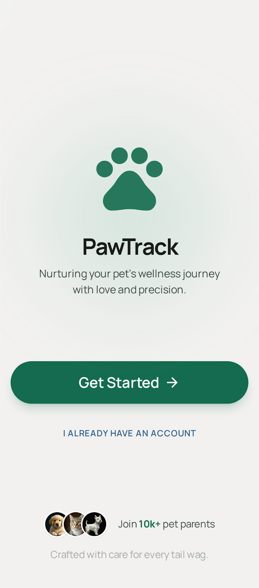
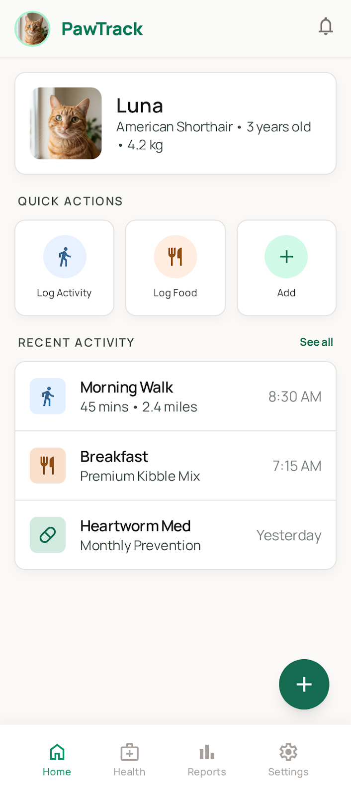
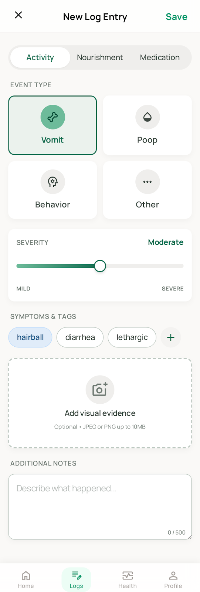
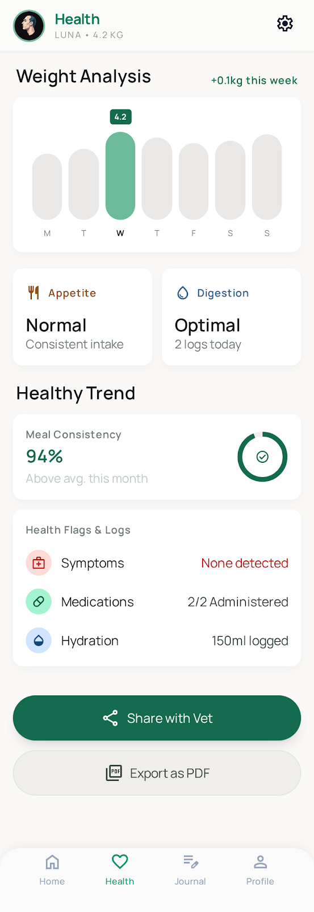
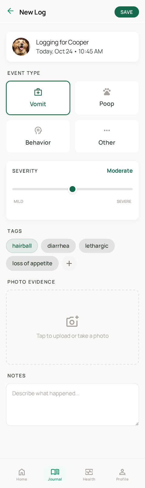
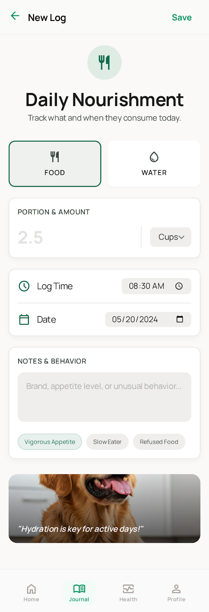
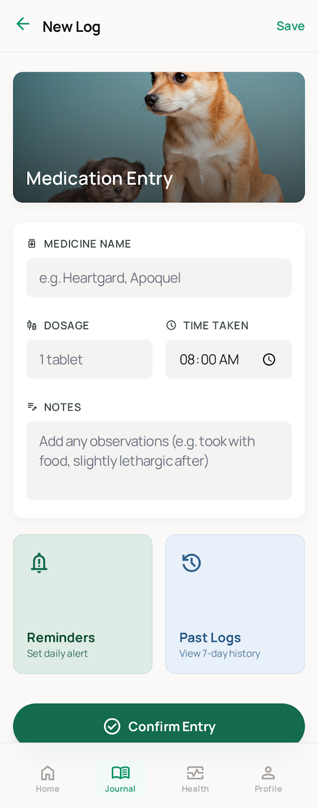
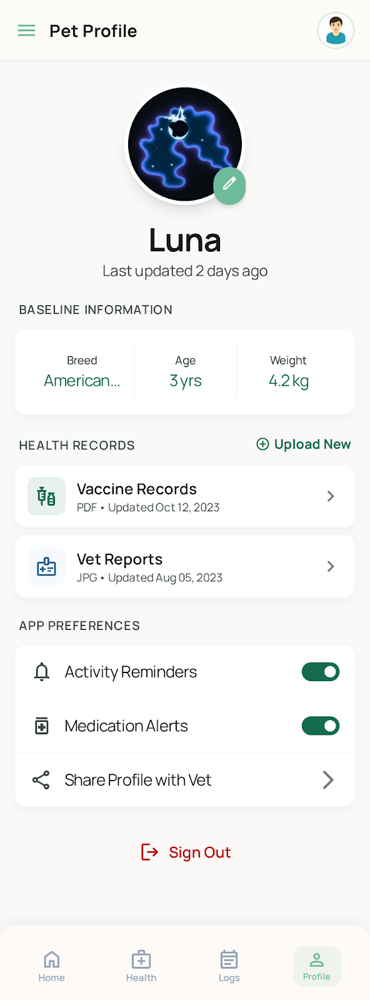
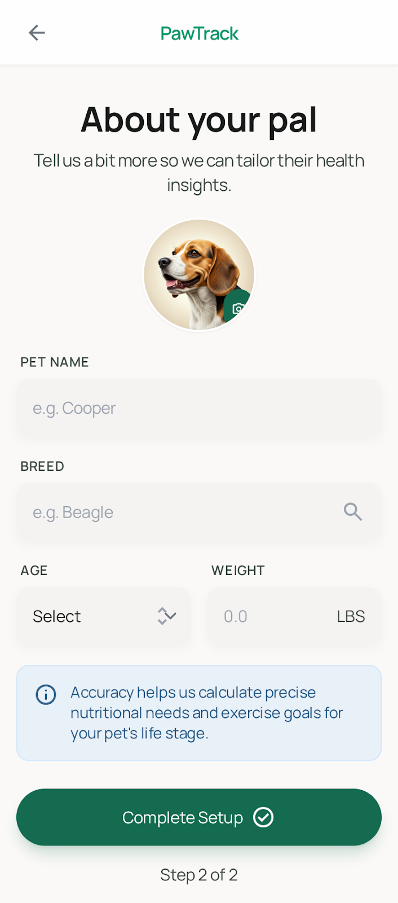
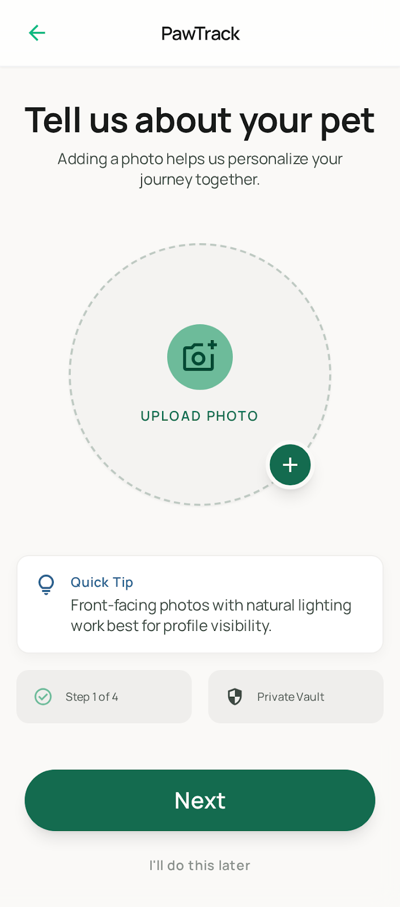

# PawTrack 🐾

PawTrack is a simple iOS app for tracking pet health and daily activities, designed to help pet owners provide accurate, structured information to veterinarians.

## ✨ Features

* 🐱 Pet profile management (breed, age, medical info, photo)
* ⚖️ Weight tracking with time-series history
* 📝 Activity logging (e.g. vomiting, stool condition, behavior)
* 🍽️ Food & water intake tracking
* ⏰ Reminders for vet visits and vaccinations
* 📊 Exportable reports for vet visits (date-range based)

## 🎯 Goal

Pet owners often rely on memory when describing symptoms to vets. PawTrack aims to replace guesswork with structured, reliable data.

## 🛠 Tech Stack 

* SwiftUI
* SwiftData / CoreData
* Local Notifications
* PDF / CSV export

## Design

Key flows and screens are shown below from the generated design previews.

### Core pages

- **Welcome** - first-launch onboarding and app overview.  
  
- **Home Dashboard** - daily snapshot with quick access to logging actions.  
  
- **Unified Log Entry** - central entry point for adding health records quickly.  
  
- **Health Reports** - trend-focused summaries designed for vet discussions.  
  

### Log entry variants

- **New Activity Log** - symptom, behavior, and event-specific activity records.  
  
- **New Food/Water Log** - meal and hydration tracking with structured inputs.  
  
- **New Medication Log** - dosage, schedule, and medication adherence records.  
  

### Pet profile pages

- **Pet Profile** - high-level pet identity and profile overview.  
  
- **Pet Details** - deeper pet information including background and context.  
  
- **Pet Photo** - pet image selection and profile photo display.  
  

---

Built to make vet visits easier and more accurate 🐾
